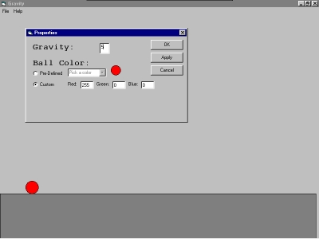



## Gravity

### Description

You set the gravity and everything,

drag the ball and then watch it drop

to the ground
 
### More Info
 
Colors,Numbers

Unzip it. Run it!!

A falling shape on a form!

             |
---                |---
**Submitted On**   |2001-01-04 23:08:48
**By**             |[Brendan Zerr](https://github.com/Planet-Source-Code/PSCIndex/blob/master/ByAuthor/brendan-zerr.md)
**Level**          |Intermediate
**User Rating**    |4.0 (20 globes from 5 users)
**Compatibility**  |VB 5\.0, VB 6\.0
**Category**       |[Miscellaneous](https://github.com/Planet-Source-Code/PSCIndex/blob/master/ByCategory/miscellaneous__1-1.md)
**World**          |[Visual Basic](https://github.com/Planet-Source-Code/PSCIndex/blob/master/ByWorld/visual-basic.md)
**Archive File**   |[CODE\_UPLOAD13394152001\.zip](https://github.com/Planet-Source-Code/brendan-zerr-gravity__1-14143/archive/master.zip)

